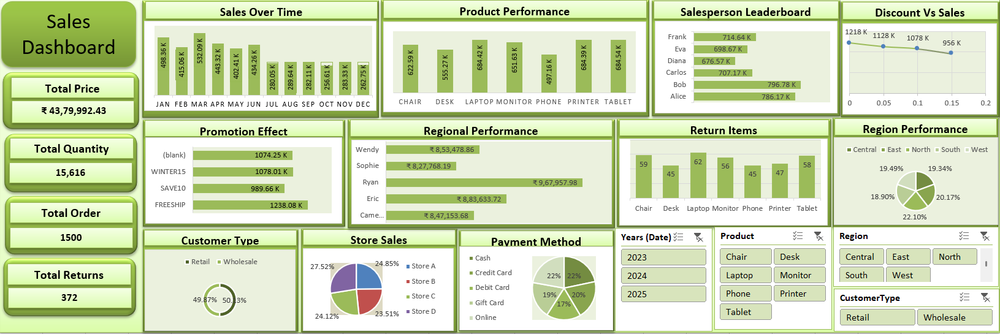

# 📊 Regional Sales Performance Analysis
  
**Project Type:** Excel-Based Sales Performance & Business Intelligence Dashboard  
**Time Period:** 2023 – 2025  

---

## 📑 Table of Contents

 [Project Overview](#-project-overview)   
 [Business Problem Statement](#-business-problem-statement)    
 [Business Objectives](#-business-objectives)
 [Dataset Overview](#-dataset-overview)  
 [Tools & Techniques](#-tools--techniques)  
 [Data Preparation & Cleaning](#-data-preparation--cleaning)  
 [Methods and Excel Implementation](#-methods-and-excel-implementation)  
 [Files in This Repository](#-files-in-this-repository)  
 [Dashboard Overview](#-dashboard-overview)  
 [How to Run the Project](#-how-to-run-the-project) 
 [Key Performance Indicators (KPIs)](#-key-performance-indicators-kpis)  
 [Key Insights & Findings](#-key-insights-&-findings)    
 [Business Recommendations](#-business-recommendations)  
 [Conclusion](#-conclusion)  
 [Contact](#-contact)  

 
---

## 📘 Project Overview

This project focuses on analyzing **product-wise and region-wise sales data** to evaluate business performance, customer behavior, promotion effectiveness, and operational efficiency.

Using **Advanced Microsoft Excel**, raw transactional data was transformed into a **dynamic and interactive sales dashboard** designed to support management-level decision-making.

This project closely reflects real-world responsibilities of:

- Data Analyst  
- Business Analyst  
- MIS Analyst  
- Reporting Analyst  

---

## ❓ Business Problem Statement

The organization faced challenges in answering critical business questions:

- Which products generate the highest revenue?
- How does sales vary across months and years?
- Which regions and stores contribute most?
- Are discounts increasing revenue or reducing profit?
- Which promotions perform best?
- What is the return rate across products?
- Which customer segment drives growth?

Lack of a centralized dashboard made analysis manual, slow, and inefficient.

---

## 🎯 Business Objectives

- Analyze overall sales performance (2023–2025)
- Identify top and low-performing products
- Understand monthly and yearly sales trends
- Evaluate discount and promotion effectiveness
- Analyze region-wise and store-wise performance
- Measure salesperson contribution
- Segment customers (Retail vs Wholesale)
- Track return quantity and operational risk
- Build an executive-level Excel dashboard

---

## 🗂 Dataset Overview

**Data Source:** Internal structured Excel sales dataset  
**Time Period:** 2023 – 2025  

### Dataset Attributes

| Category | Fields |
|--------|--------|
| Sales | Order ID, Order Date, Sales Amount |
| Product | Product Name, Category |
| Customer | Customer Type (Retail / Wholesale) |
| Geography | Region |
| Operations | Quantity Sold, Returns |
| Marketing | Discount %, Promotion Code |
| Finance | Payment Method |
| Store | Store Location |
| People | Salesperson Name |

---

## 🛠 Tools & Techniques

- Microsoft Excel (Advanced)
- Pivot Tables & Pivot Charts
- Power Query
- Advanced Excel Formulas
- Conditional Formatting
- KPI Cards
- Interactive Slicers
- Timeline Filters
- Dashboard Design Best Practices

---

## 🧹 Data Preparation & Cleaning

- Removed duplicate records
- Handled null and blank values
- Standardized date formats
- Converted text to numeric fields
- Created derived columns:
  - Year
  - Month
  - Total Revenue
  - Discount Slabs
- Validated product and region consistency

---

## 📊 Methods & Excel Implementation

### Analytical Methods
- Exploratory Data Analysis (EDA)
- Descriptive Statistics
- Time-Series Analysis
- Product Performance Analysis
- Regional Contribution Analysis
- Discount vs Revenue Analysis
- Promotion Effectiveness Analysis
- Customer Segmentation
- KPI Benchmarking

### Excel Implementation
- Pivot-based data modeling
- Dynamic charts with slicers
- Formula-driven KPIs
- Conditional formatting for insights
- Clean executive dashboard layout

---

## 📂 Files in This Repository

📁 **Product Region Sales Performance & Analysis**  
│  
├── 📊 Regional Sales Performance Analysis (.xlsx)  
├── 📄 Product Region Sales Analysis Report (.docx)  
├── 🖼 Product Region Sales Analysis Dashboard Image (.png)  
├── 📘 README.md  

---

## 🖥 Dashboard Overview

The dashboard provides a consolidated view of all major sales KPIs and performance indicators.

### Dashboard Includes:

- KPI Summary Cards  
- Sales Over Time Analysis  
- Product Performance Comparison  
- Salesperson Leaderboard  
- Discount vs Sales Trend  
- Promotion Effectiveness  
- Regional Performance Distribution  
- Return Item Analysis  
- Customer Type Breakdown  
- Store-wise Contribution  
- Payment Method Analysis  

---

### 📸 Dashboard Preview

---

## ▶️ How to Run the Project

1. Download the Excel file from the repository  
2. Open using **Microsoft Excel 2019 or later**  
3. Enable Editing and Content  
4. Use slicers to filter:
   - Year  
   - Product  
   - Region  
   - Customer Type  
5. Dashboard visuals update dynamically

---

## 📌 Key Performance Indicators (KPIs)

| KPI | Value |
|----|------|
| Total Revenue | ₹43,79,992.43 |
| Total Quantity Sold | 15,616 Units |
| Total Orders | 1,500 |
| Total Returns | 372 |
| Average Order Value | ₹2,920(approx) |
| Return Rate | ~2.38% |

---

## 🔍 Key Insights & Findings

### 📈 Sales Trend Analysis
- Peak sales during **March–May**
- Sales decline during **July–September**
- Recovery observed in **Q4**

---

### 🧾 Product Performance
- Tablet – ₹684K+
- Printer – ₹684K+
- Laptop – ₹684K+
- Monitor – ₹651K+

Lower-performing:
- Chair
- Desk

---

### 👨‍💼 Salesperson Performance
Top contributors:
- Bob – ₹796.78K
- Alice – ₹786.17K
- Frank – ₹714.64K

---

### 💸 Discount vs Sales
- Higher discounts reduce revenue
- Best performance at low or zero discount

---

### 🎁 Promotion Effectiveness
| Promotion | Revenue |
|--------|--------|
| FREESHIP | ₹1,238K |
| WINTER15 | ₹1,078K |
| SAVE10 | ₹989K |

---

### 🌍 Regional Performance
- South – 22.10%
- West – 20.17%
- Central – 19.49%
- North – 19.34%
- East – 18.90%

---

### 🔁 Return Analysis
Highest returns:
- Laptop – 62 units
- Tablet – 58 units
- Monitor – 56 units

---

### 👥 Customer Segmentation
- Retail – 50.3%
- Wholesale – 49.7%

---

### 🏬 Store Performance
- Store D – 27.52%
- Store A – 24.85%
- Store C – 24.12%
- Store B – 23.51%

---

### 💳 Payment Method Analysis
- Cash – 22%
- Online – 22%
- Credit Card – 20%
- Debit Card – 19%
- Gift Card – 17%

---

## 🚀 Business Recommendations

- Convert dashboard to **Power BI / Tableau**
- Add cost & profit margin analysis
- Integrate SQL database backend
- Automate refresh using Power Query
- Improve quality checks for high-return products
- Optimize discount strategy
- Expand successful promotions

---

## ✅ Conclusion

This project demonstrates an **end-to-end data analytics lifecycle**, transforming raw sales data into actionable business insights.

It highlights strong skills in:

- Data analysis  
- Excel dashboard development  
- Business intelligence reporting  
- Stakeholder-oriented storytelling  

The project aligns strongly with real-world **Data Analyst and Business Analyst roles**.

---

## 📬 Contact

**Risit Sahoo**  
📧 Email: risit.sahoo121@gmail.com  
🔗 LinkedIn: https://linkedin.com/in/risitsahoo

---
